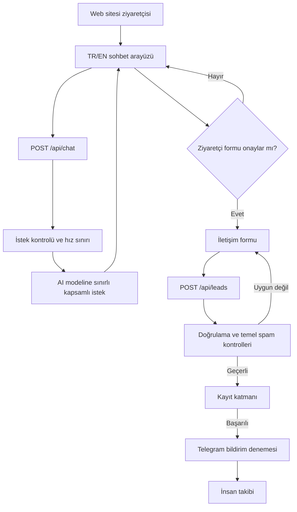

# İşletmeler için AI Karşılama ve İletişim Akışı

**Vaka türü:** Kişisel iş sistemi prototipi · **Durum:** MVP / güncel canlı kabulü doğrulanmadı  
**Kaynak çalışma:** Özel `hakan-leonardo` deposu · **İnceleme:** 3 Ekim 2026

## 1. Problem

Bir hizmet web sitesine gelen ziyaretçi, ihtiyacını nasıl anlatacağını veya hangi çözümün uygun olduğunu her zaman bilemez. Aynı zamanda her talebin manuel olarak ilk elden karşılanması, iletişim bilgilerinin düzensiz toplanmasına ve takibinin zorlaşmasına neden olabilir.

Bu prototipin amacı; ziyaretçiyi kısa, sınırları belirlenmiş bir keşif akışıyla karşılamak, talebi bir iletişim formuna yönlendirmek ve geçerli kayıtları insan takibine hazır hale getirmektir. Burada gerçek müşteri sonuçları veya otomatik satış iddiası bulunmaz.

## 2. Sistem akışı

**İki ayrı işlem sınırı vardır:** AI sohbeti ziyaretçiye yönelik yanıt üretir; kişisel iletişim bilgilerinin alınması ise ayrı form ve API üzerinden yapılır. Modelin doğrudan veritabanı veya mesajlaşma sisteminde işlem yapma yetkisi olduğu iddia edilmez. Telegram başarısız olsa da kayıt işleminin sonucuyla bildirim sonucu ayrı raporlanır.

## 3. Uygulanan bileşenler (kod incelemesi)

| Katman | Uygulanan yaklaşım |
| --- | --- |
| Arayüz | React / Next.js tabanlı Türkçe ve İngilizce sayfalar; sohbet ve iletişim formu |
| Sohbet | AI SDK `useChat` ile `/api/chat` bağlantısı; OpenAI sağlayıcısına yönelen akış kodu |
| Sohbet sınırları | İstek biçimi, mesaj sayısı ve boyutu kontrolü; kapsamlandırılmış sistem talimatları; hız sınırlama |
| Talep işleme | `/api/leads` uç noktasıyla sunucu tarafında alan doğrulaması ve normalleştirme |
| Temel korumalar | Honeypot, minimum form doldurma süresi, alan uzunluğu kontrolleri ve bellekte hız sınırlama |
| Kayıt | Sunucu tarafında Supabase REST ekleme katmanı (yapılandırmaya bağlı) |
| Bildirim | Kayıt başarılı olduktan sonra Telegram bildirimi denemesi (yapılandırmaya bağlı) |
| Sonraki adım | İnsan tarafından geri dönüş; otonom teklif/ödeme veya CRM yürütmesi yok |

Teknoloji kapsamı: **Next.js, React, TypeScript, Tailwind CSS, AI SDK, OpenAI entegrasyon kodu, Supabase ve Telegram API**. Bunların tümünün aynı anda canlı ortamda çalıştığı ayrıca doğrulanmış değildir.

## 4. Kanıt ve test durumu

| Kriter | Elde bulunan kanıt | Sınır |
| --- | --- | --- |
| Sohbet model entegrasyonu | Güncel sohbet bileşeni ile `/api/chat` sunucu kodu incelendi | Güncel model çağrısının canlı uçtan uca testi yapılmadı |
| Supabase kaydı | 22 Haziran 2026 tarihli yerel test kayıtları, deneme lead'i için `stored` sonucunu belgeliyor | Daha sonraki kod/deploy sürümü için yeniden test gerekir |
| Telegram bildirimi | Aynı tarihli yerel kayıtlar `sent` yanıtını ve geliştirici teyidini belgeliyor | Bildirim hatasında ayrık sonuç davranışı canlı olarak yeniden test edilmedi |
| Form/doğrulama | Önceki yerel testlerde zorunlu alan, spam kontrolleri ve hız sınırı senaryoları yer alıyor | Güncel kodda yeniden çalıştırılmadı |
| Web arayüzü | Geçmiş yerel Firefox kontrollerinde masaüstü/mobil düzen incelendi | Güncel arayüz ve yayın ortamı yeniden kontrol edilmeli |
| Yayın ve işletim | Kaynak depodaki eski yayın checklist'i tamamlanmamış kalemler içeriyor | Üretim ortamı için güncel kabul kanıtı yok |

**Not:** Önceki belgelerdeki yerel doğrulamalar, bugün yeniden çalıştırılmış testler değildir. Bazı eski dokümanlar sohbeti kural tabanlı olarak tanıtırken güncel kodda AI SDK/OpenAI yolu bulunduğundan, geçmiş doğrulama sonuçları otomatik olarak yeni sohbet yoluna taşınamaz.

## 5. Tasarım kararları

- **Düşük yetki:** Sohbet katmanı bilgi verir ve formu teklif eder; talep kaydı ayrı uç noktadadır.
- **Açık kullanıcı adımı:** İletişim formu, ziyaretçinin açık kabulü üzerine arayüzde açılacak şekilde kurgulanır.
- **Sunucu doğrulaması:** İstemciden gelen veriler yalnızca arayüz kontrolüne güvenilmeden doğrulanır.
- **Hata ayrımı:** Kayıt ve bildirim sonucu farklı durumlar olarak raporlanır.
- **İnsan devri:** Ticari değerlendirme ve sonraki iletişim insana bırakılır.

## 6. Eksikler ve riskler

1. **Canlı doğrulama:** Güncel AI akışı, model yanıt kalitesi, formu açma etkileşimi, Supabase ve Telegram beraberce yeniden test edilmeli.
2. **Hız sınırlama:** Süreç içi bellek kullanan sınırlandırma dağıtık/sunucusuz çalışma için kalıcı güvenlik kontrolü sayılamaz.
3. **Model davranışı:** Prompt kuralları tek başına güvenlik garantisi değildir; kötüye kullanım, talimat enjeksiyonu ve yanlış yönlendirme senaryoları için ek test gerekir.
4. **İşletim:** Hata izleme, üretim gözlemlenebilirliği, erişim ve veri saklama politikaları ayrıca doğrulanmalı.
5. **Kanıt güncelliği:** Eski belgelerle güncel kod arasında farklar var; test kayıtları yeni sürüme göre güncellenmeli.

## 7. Sonuç ve kapsam sınırı

Bu çalışma, **gerçek kod temeli bulunan bir AI destekli iş talebi toplama MVP'sinin mimarisini** belgeliyor. Ticari performans, üretim kararlılığı, tamamlanmış CRM, satış otomasyonu veya insan müdahalesi olmadan iş yürüten bağımsız ajan özellikleri bu vaka kapsamında **iddia edilmiyor**.

Bu kamuya açık örnek, uygulama deposunun yerine geçmez ve özel kaynak kodunu paylaşmaz.
